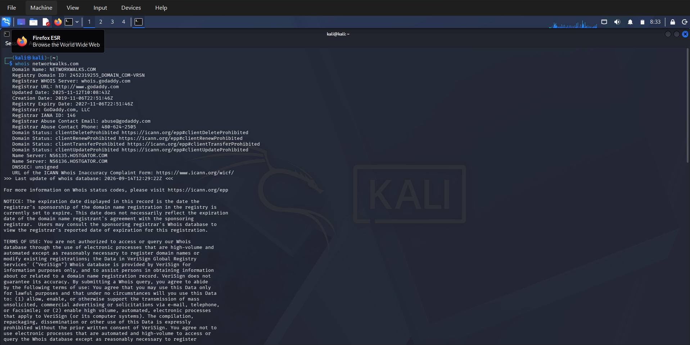
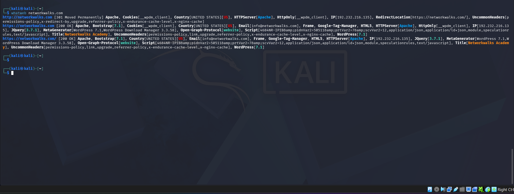
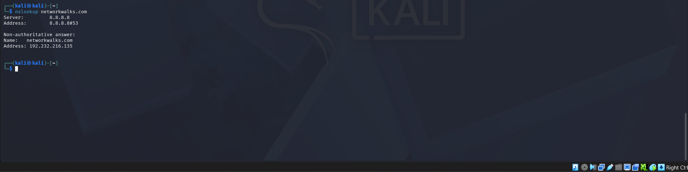
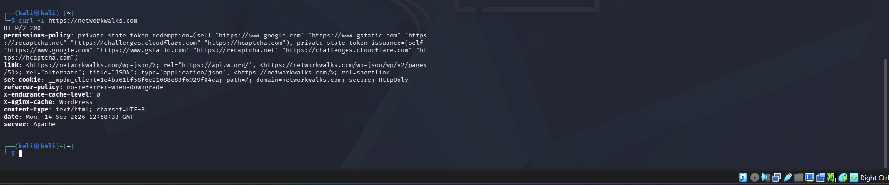

# PENETRATION TESTING REPORT (SAMPLE)
### Footprinting & Network Scanning Phases

**W2-PM-FINAL  |  CYBERSECURITY  |  NETWORKWALKS**

| Field | Detail |
|---|---|
| **Pentester Name (Cybersecurity Professional)** | **Ayisire I. Oghenechovwe** |
| **Program/Batch** | B082-Networkwalks |
| **Date** | 17 September 2026 |
| **Modules completed** | W2-PM1 (Multiple Kali Tools) W2-PM5 (Zenmap Scanning) |
| **Client/Target** | 1. Networkwalks (secured written permission already) 2. My own local LAN Network |
| **Permission secured from client?** | Yes |
| **Phases covered** | **Phase 1:** Reconnaissance & Footprinting **Phase 2:** Scanning & Network Discovery **Phase 3-5:** In Progress |

# 1. Liability Disclaimer

All activities documented in this report were conducted exclusively on systems and devices that I own or for which I obtained prior written authorization to perform security testing. The information and materials presented are intended solely for educational and research purposes.
This knowledge must not be used to gain unauthorized access to, disrupt, or compromise any system or device. Any actions taken based on the information contained in this report are the sole responsibility of the individual performing them. The instructor, authors, and Networkwalks assume no responsibility for any misuse of the knowledge or techniques presented.
Unauthorized access to computer systems may constitute a criminal offense, even where no damage or disruption occurs. Such activities may result in criminal prosecution, substantial financial penalties, termination of employment, and a permanent criminal record. Users should therefore ensure that appropriate authorization is obtained before conducting any security testing.

# 2. Introduction

This report covers two activities completed during Week 2 of my ongoing internship program at Networkwalks. The first activity involved gathering information about the **networkwalks.com** domain using different Kali Linux tools (W2-PM1), while the second involved scanning my own local network using **Zenmap** (W2-PM5).
The two activities focus on different stages of network security testing. The footprinting exercise shows how information can be collected about a target from publicly available sources, while the scanning exercise focuses on identifying live devices and hosts within a network. Together, they show the basic process of moving from information gathering to network discovery.
The footprinting tasks were carried out in **Kali Linux**, while the scanning exercise was performed on a **Windows PC with Zenmap installed**. For each step, I included the command I used, the result I obtained, a screenshot as evidence, and a brief explanation of why the finding could be important from a security or attacker's point of view.

# 3. Tools Used

The table below lists each tool used in this report and its purpose.

| Tool | Purpose |
|---|---|
| Kali Linux & Windows | Operating systems used for reconnaissance activities             |
| WHOIS                | Find domain registration details (owner, dates, name servers).   |
| whatweb              | Fingerprint web technologies (server, CMS, plugins, IP).         |
| nslookup             | Resolve the domain name to its IP address using DNS.             |
| curl -I              | Read the HTTP response headers of the website.                   |
| wafw00f              | Detect whether a Web Application Firewall protects the site.     |
| dnsrecon             | Enumerate all DNS records (NS, MX, SPF, TXT, SRV).               |
| Zenmap (Nmap GUI)    | Scan the local subnet to find live hosts, IPs and MAC addresses. |
| Windows CMD          | Local IP and MAC address identification                          |

# 4. Activities Performed

## 4.1 Footprinting & Reconnaissance

I performed reconnaissance against the `networkwalks.com` domain using six Kali Linux tools: **WHOIS, WhatWeb, Nslookup, Curl, Wafw00f and DNSRecon**. Each tool was used to collect a different type of information about the target.

First, I used **WHOIS** to obtain publicly available domain registration information and identify the domain’s name servers. The results provided information about the domain registration and hosting infrastructure.

I then used **WhatWeb** to identify technologies used by the website. The results identified **WordPress 7.1** and **WP Download Manager 3.3.58**, along with other information exposed by the website.

Using **Nslookup**, I resolved the domain name to its IP address. The provided result identified **192.232.216.135**.

I used **Curl** with the `-I` option to inspect the HTTP response headers. This provided additional information about the web application and exposed the WordPress REST API endpoint `/wp-json/`.

Next, I used **Wafw00f** to determine whether a Web Application Firewall was protecting the website. The result identified **ModSecurity (SpiderLabs)**.

Finally, I used **DNSRecon** to enumerate DNS records. The results provided information relating to name servers, mail servers, SPF/TXT records, service records and DNS software information.

## 4.2 Network Scanning with Zenmap

For the second activity, I used **Zenmap** to perform network discovery on my local network. The practical required me to identify my local IP address and subnet, discover live hosts, identify their IP and MAC addresses, and generate a network topology.

I first used the Windows `ipconfig` command to identify my local IP address and LAN subnet. I then entered the subnet into Zenmap and selected **Ping Scan** to identify active hosts.

The example results provided in the practical identified four live hosts:

- `10.0.0.0`
- `10.0.0.3`
- `10.0.0.4`
- `10.0.0.6`

The example results also included one MAC addresses.

After completing the scan, I opened the **Topology** section in Zenmap, enabled the legend and saved the network topology in PDF format as required by the practical task.

# 5. Risk Analysis / Impact

Based on the information collected during the footprinting and network scanning activities, I identified the following potential risks.

| **\#** | **Risk / Finding**                           | **Evidence / Observation**                                  | **Potential Impact**                                                                                            | **Risk Level** |
|--------|----------------------------------------------|-------------------------------------------------------------|-----------------------------------------------------------------------------------------------------------------|----------------|
| 1      | Web technology information exposed           | WhatWeb identified WordPress and WP Download Manager        | Attackers may use exposed technology/version information to identify software requiring further security review | **● Medium**   |
| 2      | Server IP address identifiable               | Nslookup resolved the domain to `192.232.216.135`           | Provides information about the network location of the web service                                              | **● Low**      |
| 3      | HTTP technical information exposed           | Curl returned HTTP response headers and exposed `/wp-json/` | May assist technology fingerprinting and further enumeration                                                    | **● Low**      |
| 4      | WAF technology identifiable                  | Wafw00f identified ModSecurity (SpiderLabs)                 | Reveals information about the web application’s security architecture                                           | **● Low**      |
| 5      | DNS infrastructure information exposed       | DNSRecon identified DNS, mail and service-related records   | DNS information can help build a broader infrastructure profile                                                 | **● Medium**   |
| 6      | Multiple live hosts visible on local network | Zenmap identified four live hosts in the example network    | Unknown or unauthorized devices may potentially be present on a network                                         | **● Medium**   |

**Risk level key:** ● Critical ● Medium ● Low

The risks above are observations from the footprinting and scanning exercises, not confirmed vulnerabilities.

The practical exercises primarily involved information gathering and host discovery. No exploitation or vulnerability validation was performed as part of these two modules.

Therefore, the presence of information such as a software version, IP address or DNS record does not by itself mean that the system is vulnerable. Further authorized security testing would be required to confirm any actual vulnerability.

# 6. Recommendations

Based on the findings and observations from these activities, the following security improvements are recommended:

1. **Review Publicly Exposed Technology Information**
   Organizations should regularly assess the technical information publicly available about their websites, including details about CMS platforms, plugins, and other technologies in use.

2. **Keep Software and Technologies Updated**
   CMS platforms, plugins, and other web technologies should be kept up to date. Security advisories should also be monitored to identify and address known vulnerabilities.

3. **Review HTTP Response Headers**
   HTTP response headers should be periodically reviewed to identify and minimize the exposure of unnecessary technical information that could assist an attacker.

4. **Regularly Review DNS Records**
   DNS records should be reviewed regularly to ensure that only necessary services and information are publicly accessible.

5. **Properly Configure and Monitor the WAF**
   The Web Application Firewall (WAF), including ModSecurity, should remain enabled, properly configured, and regularly tuned. Its existing ability to block basic or automated attacks should be maintained and monitored.

6. **Conduct Regular Internal Network Discovery**
   Organizations should periodically scan their internal networks to identify active devices and maintain an accurate understanding of the network environment.

7. **Investigate Unidentified Devices**
   Any unfamiliar or unexpected device identified during network discovery should be investigated and verified to determine whether it is authorized.

8. **Maintain Accurate Network Documentation**
   Network topology, connected devices, IP addresses, and other relevant infrastructure information should be properly documented and regularly updated.

9. **Conduct Security Testing with Proper Authorization**
   Reconnaissance, scanning, and other security testing activities should only be performed on systems and networks where appropriate authorization has been obtained.

# 7. Conclusion

During Week 2 of my Cybersecurity & Ethical Hacking internship, I completed practical exercises focused on footprinting, reconnaissance, and network scanning.

For the footprinting exercise, I used six Kali Linux tools to gather information about the target domain. Through this activity, I learned how **WHOIS** can be used to obtain domain registration information, **WhatWeb** can identify web technologies, **Nslookup** can resolve domain names and retrieve DNS information, **Curl** can be used to examine HTTP response headers, **Wafw00f** can help identify web application firewalls, and **DNSRecon** can provide additional information about DNS records and configurations.

For the network scanning exercise, I used **Zenmap** to examine my local network configuration and identify active hosts. I also gathered available IP and MAC address information and used the results to create a basic network topology.

These exercises helped me understand the importance of information gathering in cybersecurity. Before attempting to identify or exploit vulnerabilities, a security professional can obtain valuable information about a target environment by analyzing publicly available data and observing network responses.

I also learned the importance of properly documenting technical findings. An effective cybersecurity report should clearly explain the activities performed, the information discovered, the significance of each finding, the potential security implications, and the recommended measures for reducing associated risks.

Finally, I learned that reconnaissance and network scanning must always be conducted within an authorized scope. All activities documented in this report were performed as part of the assigned educational cybersecurity laboratory exercises.

# 8. Evidences Collected

*Screenshots collected as evidence during the activities (stored in the `screenshots/` folder):*

-End-
